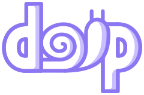

# doip.js

[](https://ci.codeberg.org/repos/5907)
[](https://codeberg.org/keyoxide/doipjs/src/branch/main/LICENSE)
[](https://fosstodon.org/@keyoxide)
[](https://opencollective.com/keyoxide)




[doip.js](https://codeberg.org/keyoxide/doipjs) allows websites and Node.js projects to verify decentralized online
identities.

Documentation available at [js.doip.rocks](https://js.doip.rocks).

## Installation (node)

Install using **yarn** or **npm**:

```bash
yarn add doipjs
# or
npm install --save doipjs
```

Import the `doip` module in your code:

```javascript
const doip = require('./doipjs')
```

## Installation (browser)

Include the following HTML snippet (requires [openpgp.js](https://openpgpjs.org/)):

```html
<script src="/static/openpgp.min.js"></script>
<script src="/static/doip.min.js"></script>
```

## Quickstart

Run the following javascript:

```javascript
const verifyIdentity = async (url, fp) => {
  const claim = new doip.Claim(url, fp)
  claim.match()
  await claim.verify()
  console.log(claim.result)
}
verifyIdentity('dns:doip.rocks', '9f0048ac0b23301e1f77e994909f6bd6f80f485d')
```

This snippet verifies the [doip.rocks](https://doip.rocks) domain as
bidirectionally linked to Yarmo's cryptographic key.

## Contributing

Anyone can contribute!

Developers are invited to:

- fork the repository and play around
- submit PRs to [implement new features or fix bugs](https://codeberg.org/keyoxide/doipjs/issues)

If you are new to contributing to open source software, we'd love to help you! To get started, here's a [list of "good first issues"](https://codeberg.org/keyoxide/doipjs/issues?q=&type=all&state=open&labels=183598) that you could look into.

Everyone is invited to:

- find and [report bugs](https://codeberg.org/keyoxide/doipjs/issues/new/choose)
- suggesting [new features](https://codeberg.org/keyoxide/doipjs/issues/new/choose)
- [help with translations](https://translate.codeberg.org/projects/keyoxide/)
- [improve documentation](https://codeberg.org/keyoxide/keyoxide-docs)
- start using open source software and promote it

Please note that this project has a [Code of Conduct](https://codeberg.org/keyoxide/web/src/branch/main/CODE_OF_CONDUCT.md) that all contributors agree to abide when participating.

## About the Keyoxide project

The Keyoxide project strives for a healthier internet for all and has made its efforts fully [open source](https://codeberg.org/keyoxide). Our [community](https://docs.keyoxide.org/community/) is open and welcoming, feel free to say hi!

Funding for the project comes from the [NLnet foundation](https://nlnet.nl/), [NGI0](https://www.ngi.eu/) and the people supporting our [OpenCollective](https://opencollective.com/keyoxide). The project is grateful for all your support.
